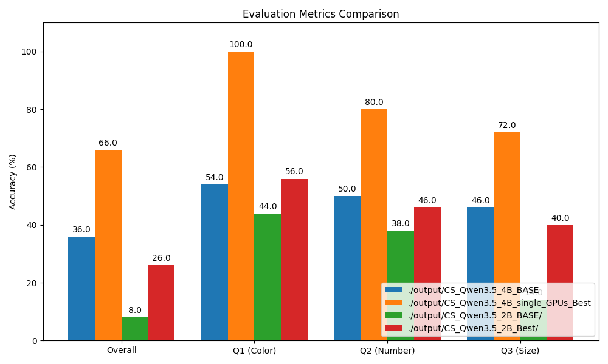

# CountingStars 🌟

A mini-project and tutorial demonstrating how to fine-tune **Vision Large Language Models (VLLMs)**—specifically **Qwen 3.5**—using **GRPO (Generative Reward Policy Optimization)**. 

## 🚀 Features

- **Vision-Language Models**: Fine-tuning Qwen 3.5 Vision architectures (e.g., 0.8B, 2B and [4B](https://www.modelscope.cn/models/Qwen/Qwen3.5-4B)).
- **Efficient Training**: Uses [Unsloth](https://github.com/unslothai/unsloth) for ultra-fast, memory-efficient 4-bit quantized LoRA adapter preparation.
- **Reinforcement Learning (GRPO)**: Utilizes Hugging Face's `trl` library with custom deterministic reward functions for counting and analyzing stars (Color, Number, Size).
- **Multi-GPU Scaling**: Full Distributed Data Parallel (DDP) support leveraging Hugging Face `accelerate`.
- **Comprehensive Evaluation**: Extensive scripting to infer, evaluate (with difficulty breakdowns), and automatically plot the performance differences between Base vs. LoRA trained models.

## 🌟 Sample Interaction

Here is an example demonstrating exactly what the VLLM is trained to learn.

**Input Image & User Prompt:**
*(A synthetically generated image showing 5 randomly sized, colored stars)*


```text
Look at the image and answer the following questions:
1. What is the color of the largest star?
2. How many stars are there in total?
3. How many large stars are there?
```

**Generated Result:**
```xml
<answer>purple</answer>
<answer>4</answer>
<answer>1</answer>
```

## 📁 Project Structure

- `data/synthetic`: The training data and test data foloder, you can generate data follow this [Dataset Generation Guide](./docs/dataset_generation.md).
- `docs/dataset_generation.md`: Full rundown of the programmable synthetic dataset creator logic.
- `src/scripts/train_grpo.py`: Core GRPO training script. Supports single/multi-GPU training, custom metric logging to W&B, and Unsloth optimizations.
- `test_pretrained.py`: Inference script for generating answers. Capable of dynamically evaluating unmodified base models versus specific learned LoRA checkpoints.
- `src/evaluation/evaluate.py`: Metric analyzer tool. It grades the model's textual outputs against a ground truth JSON dataset and plots visually appealing comparisons using `matplotlib`.

## 🛠️ Tutorial & Workflow

### 1. Environment Setup
The project runs within a conda environment, relying heavily on PyTorch, Accelerate, Unsloth, and TRL.

I strongly recommend downloading and compiling TRL from [hugging face rtl installation](https://huggingface.co/docs/trl/installation) instead of installing it via pip. 

```bash
# Example environment activation
conda activate vllm_py311
```

### 2. Dataset Generation
The synthetic dataset consisting of images of stars and Q&A ground truth pairs is generated programmatically. For detailed instructions on how the images are styled and perfectly formatted for VLLM fine-tuning, please read the [Dataset Generation Guide](./docs/dataset_generation.md).

### 3. GRPO Training

#### Option A: Single-GPU Training (Recommended)
You can run the training script natively on a single GPU. *Note that the effective batch size will be smaller, which might result in slightly higher variance during GRPO updates.*

```bash
export CUDA_VISIBLE_DEVICES="0"
python -m src.scripts.train_grpo --epochs 2
```

#### Option B: Multi-GPU Training
To initialize the GRPO reinforcement learning loop optimally across multiple GPUs (to bypass single-GPU VRAM limits and double the effective batch size), launch using the `accelerate` module instead of standard `python`.

```bash
export CUDA_VISIBLE_DEVICES="2,3"
accelerate launch --multi_gpu --num_processes=2 -m src.scripts.train_grpo --epochs 2
```
*Note: Make sure the base path (e.g. `../Qwen3.5-4B`) in your script points to your downloaded Qwen model.*

### 4. Inference Generation
Test both your un-trained Base Qwen model and your newly trained LoRA model on the synthetic test dataset to generate evaluation `.txt` files.

**Testing the Base Model (Before Training):**
```bash
python test_pretrained.py --model_path ../Qwen3.5-4B --output_dir ./output/CS_Qwen3.5_4B_BASE --is_base_model
```

**Testing the Trained Model (After GRPO):**
```bash
python test_pretrained.py \
    --model_path ./results/CountingStars_GRPO_Qwen3.5_4B_multiple_GPU/lora_model \
    --output_dir ./output/CS_Qwen3.5_4B_multi_GPUs_Best
```

### 4. Metrics & Performance Plotting
Using the integrated `evaluate.py` module, you can directly compare multiple test runs point-by-point. It automatically identifies sample difficulties (Easy, Medium, Hard), verifies exact answers for Color (Q1), Count (Q2), and Size (Q3), and builds a bar chart graph!

```bash
python -m  src.evaluation.evaluate     
    --results_dirs ./output/CS_Qwen3.5_4B_BASE ./output/CS_Qwen3.5_4B_single_GPUs_Best ./output/CS_Qwen3.5_2B_BASE/ ./output/CS_Qwen3.5_2B_Best/ 
    --labels "Qwen3.5_4B_BASE" "Qwen3.5_4B_Best" "Qwen3.5_2B_Base" Qwen3.5_2B_Best \ 
    --save_plot ./output/comparison.png
```


